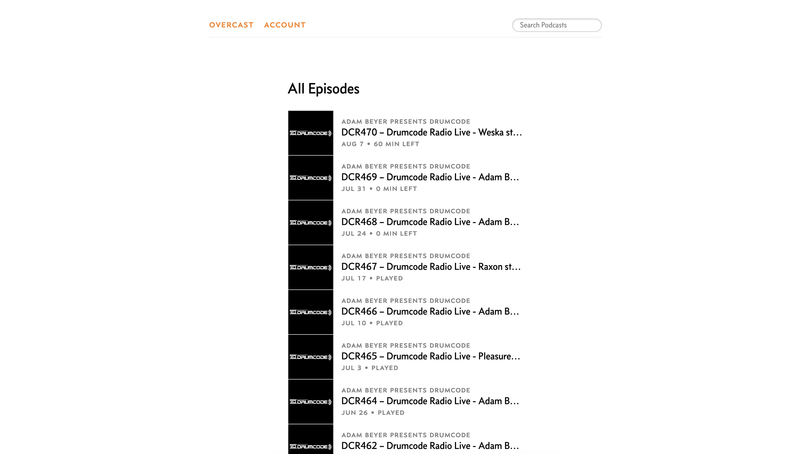
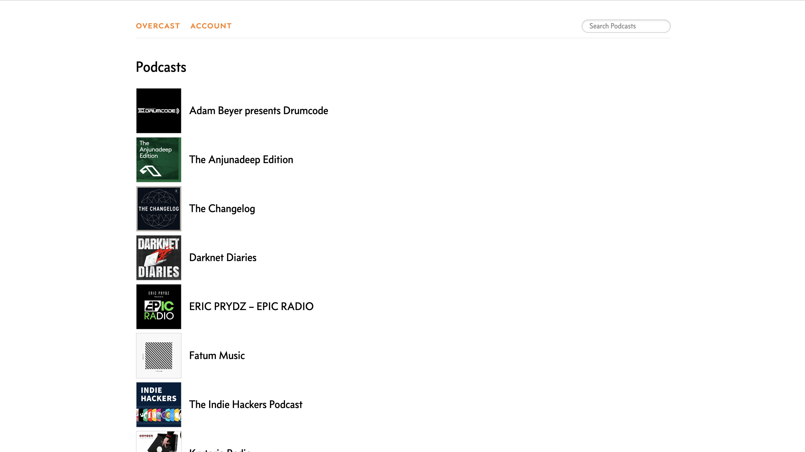
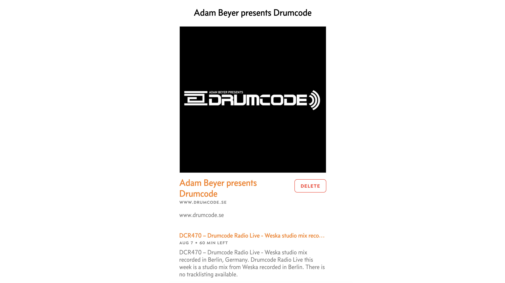

#  Refined Overcast

> Browser extension that improves [Overcast](https://overcast.fm) user interface

I'm a happy user of Overcast, but I didn't like how UI has a very small width and all long episode names are shrunk, which made me guess if the episode I was opening is the one I was looking for. So, inspired by [Refined GitHub](https://github.com/sindresorhus/refined-github), I made this extension that overwrites some of the stylesheets on Overcast's website that fixes that and some other minor issues. Learn more what it changes below.

## Install

Install it from Chrome Web Store.

## What's Changed?

Right now this extension mainly extends page width and adjusts spacing and font sizes of the interface elements. [There are more ideas](https://github.com/vadimdemedes/refined-overcast) for this project, feel free to help out!

- Extend page width and make content fill all that space
- Hide "All Episodes" section on homepage, since list of podcasts is what I care about the most
- Add margin between podcast rows on homepage, so that logos aren't right near each other
- Increase font size of podcast names to make them look proportional to logo size
- Make "Delete" button bolder by adding a red background

### Home page

<table>
	<tr>
		<th width="50%">
			Before
		</th>
		<th width="50%">
			After
		</th>
	</tr>
	<tr><!-- Prevent zebra stripes --></tr>
	<tr>
		<td>
			
		</td>
		<td>
			
		</td>
	</tr>
</table>

### Podcast page

<table>
	<tr>
		<th width="50%">
			Before
		</th>
		<th width="50%">
			After
		</th>
	</tr>
	<tr><!-- Prevent zebra stripes --></tr>
	<tr>
		<td>
			
		</td>
		<td>
			
		</td>
	</tr>
</table>
